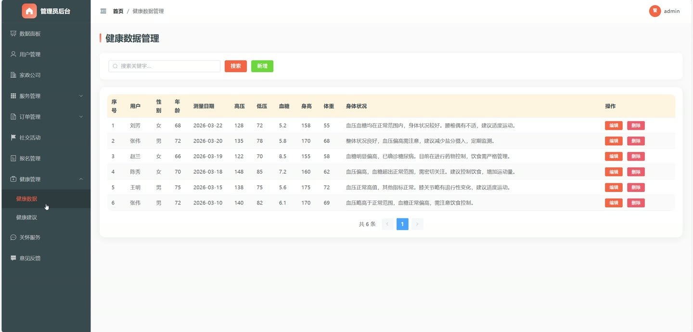
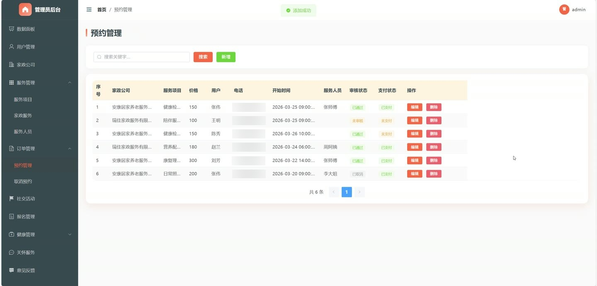
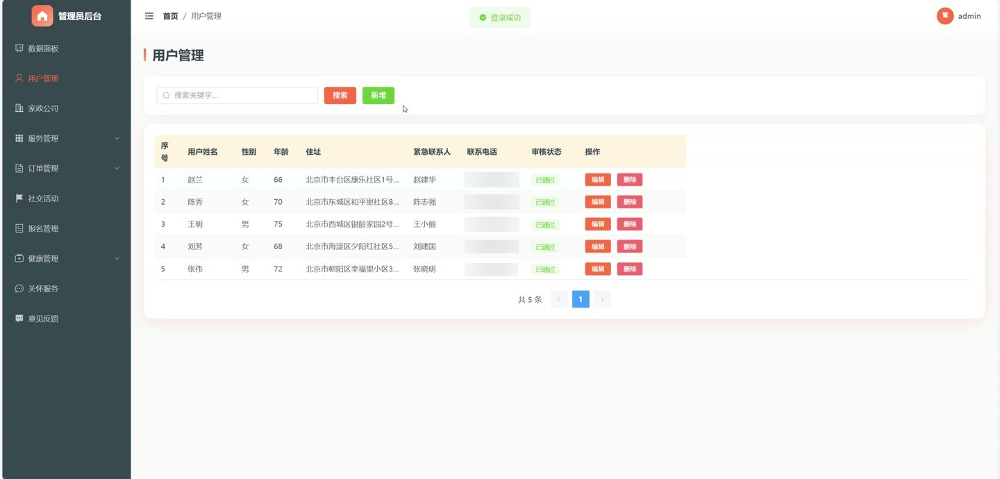
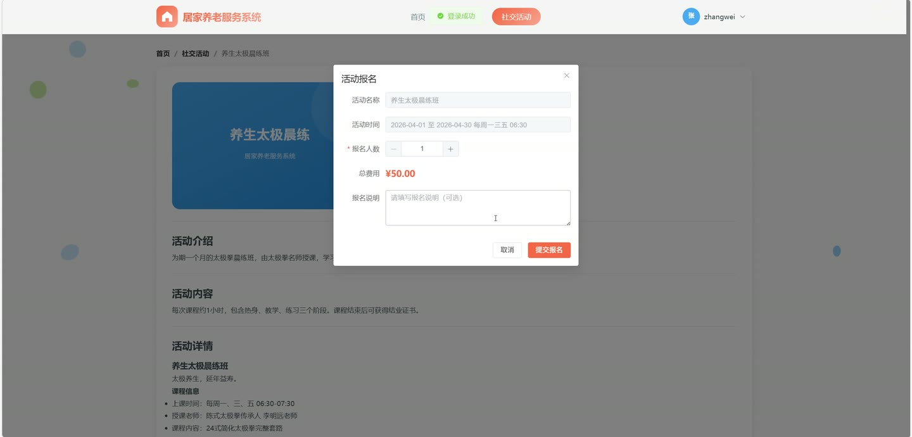

# (附文档)Springboot3+Vue3+MySQL 居家养老服务系统

**技术栈**：Springboot3、MySQL

### Springboot3+MySQL 居家养老服务系统
 
### 系统简介

本系统是一个基于 Spring Boot 3 + MySQL 的居家养老服务管理平台，采用前后端分离架构，支持普通用户、家政公司、管理员三种角色。系统提供家政服务预约、社交活动报名、健康数据管理、关怀服务、意见反馈等核心功能，帮助养老服务机构实现服务流程的数字化管理。
 
### 核心功能
 
### 普通用户端

 
- 注册与登录：通过用户名/密码注册普通用户账号，登录后获取 Sa-Token 令牌，支持退出登录和修改密码。 
- 查看个人资料：获取当前登录用户信息（头像、邮箱、手机号、角色），并补充显示注册用户详情（姓名、性别、年龄、地址、紧急联系人、联系电话）。 
- 更新个人信息：修改头像、邮箱、手机号等系统用户字段，以及修改注册用户的基本信息（姓名、性别、年龄、地址）。 
- 浏览家政服务列表：按服务项目分类或关键词搜索，查看家政服务列表（分页），默认按点赞数降序排列。 
- 查看家政服务详情：点击进入服务详情页，系统自动增加浏览次数（hits+1）。 
- 提交家政预约：选择家政服务后填写预约内容（开始时间、结束时间、服务人员、预约内容），新增预约记录并提交审核。 
- 查看我的预约列表：按用户姓名筛选，查看自己提交的预约记录（含审核状态、支付状态、家政回复）。 
- 申请取消预约：对已提交的预约发起取消申请，填写取消原因，提交后进入审核流程。 
- 浏览社交活动列表：按活动类型或关键词搜索，查看社交活动列表（分页），默认按创建时间降序排列。 
- 查看活动详情：点击进入活动详情页，系统自动增加浏览次数（hits+1）。 
- 报名参加活动：选择活动后填写报名信息（用户姓名、联系方式），新增报名记录并提交审核。 
- 查看我的报名记录：按用户姓名筛选，查看自己的活动报名记录（含审核状态、支付状态）。 
- 提交健康数据：填写血压（低压/高压）、血糖、身高、体重、身体状况等健康指标，新增健康数据记录。 
- 查看健康建议列表：按用户姓名筛选，查看系统生成的健康建议记录（含诊断内容、饮食建议、用药建议）。 
- 查看关怀服务列表：按用户姓名筛选，查看收到的关怀提醒（标题、提醒日期、内容）。 
- 提交意见反馈：填写反馈标题和内容，新增反馈记录，状态默认为“待处理”。 
- 查看我的反馈列表：按用户姓名筛选，查看自己提交的反馈记录及管理员回复。
 
### 家政公司端

 
- 公司注册：填写公司编号、公司名称、公司Logo、公司简介等资料注册家政公司账号，注册后需管理员审核通过方可登录。 
- 登录与鉴权：登录时自动校验公司审核状态，未通过审核的公司无法登录系统。 
- 管理家政服务：新增、编辑、删除本公司发布的家政服务（服务类型、服务项目、服务内容、项目介绍、服务价格、服务图片等）。 
- 管理服务人员：新增、编辑、删除本公司的服务人员信息（人员姓名、性别、年龄、联系方式、从业年限、个人简介、头像）。 
- 查看预约列表：按公司名称筛选，查看所有预约本公司的预约记录（含用户信息、服务项目、时间、审核状态）。 
- 审核预约：对“未审核”状态的预约进行审核操作，通过或拒绝并填写审核回复。 
- 回复预约：填写家政回复内容，更新预约记录的家政回复字段。 
- 查看取消申请：按公司名称筛选，查看用户发起的取消预约申请列表。 
- 审核取消申请：对取消申请进行审核，通过后自动将对应预约状态改为“已取消”，拒绝后恢复预约状态为“已通过”。 
- 管理公司信息：编辑公司名称、公司Logo、公司简介等基本资料。
 
### 管理员端

 
- 登录与权限控制：管理员账号登录，使用 Sa-Token 进行权限校验，支持退出登录。 
- 总览仪表盘：查看系统统计数据，包括用户数、家政公司数、服务数、预约数、活动数、报名数、健康数据数、关怀服务数、反馈数，以及待审核预约数和待处理反馈数。 
- 管理注册用户：分页查询所有注册用户（按姓名/性别/审核状态筛选），支持新增、编辑、删除、批量删除用户信息。 
- 审核家政公司：对“待审核”状态的家政公司进行审核，通过或拒绝并填写审核回复。 
- 管理家政公司：分页查询所有家政公司（按公司名称/编号/审核状态筛选），支持新增、编辑、删除、批量删除。 
- 管理家政服务：分页查询所有家政服务（按公司名称/服务类型/服务项目筛选），支持新增、编辑、删除、批量删除。 
- 管理服务人员：分页查询所有服务人员（按人员姓名/公司名称/性别筛选），支持新增、编辑、删除、批量删除。 
- 管理服务项目分类：分页查询所有服务项目分类，支持新增、编辑、删除、批量删除。 
- 管理预约记录：分页查询所有预约（按用户姓名/公司名称/服务项目/审核状态/支付状态筛选），支持查看详情、编辑、删除、批量删除。 
- 管理取消预约申请：分页查询所有取消申请，支持审核操作（通过/拒绝）并填写审核回复。 
- 管理社交活动：分页查询所有活动（按活动名称/活动类型筛选），支持新增、编辑、删除、批量删除。 
- 管理活动报名：分页查询所有报名记录（按用户姓名/活动名称/审核状态/支付状态筛选），支持新增、编辑、删除、批量删除。 
- 管理健康数据：分页查询所有健康数据记录（按用户姓名/性别筛选），支持新增、编辑、删除、批量删除。 
- 管理健康建议：分页查询所有健康建议记录（按用户姓名筛选），支持新增、编辑、删除、批量删除。 
- 管理关怀服务：分页查询所有关怀服务记录（按用户姓名/标题筛选），支持新增、编辑、删除、批量删除。 
- 管理意见反馈：分页查询所有反馈（按用户姓名/标题/状态筛选），支持回复反馈（填写回复内容，状态改为“已回复”），支持删除、批量删除。 
- 管理系统用户：分页查询所有系统用户（按用户名/角色筛选），支持新增、编辑、删除、批量删除，支持启用/禁用用户账号。 
- 文件上传管理：支持上传图片/视频等文件，按日期分目录存储，返回可访问的URL路径。
 
### 技术栈

 后端框架Spring Boot 3 ORMMyBatis-Plus 权限认证Sa-Token 密码加密BCryptPasswordEncoder 数据库MySQL 构建工具Maven JSON 处理Jackson Lombok简化实体类代码
 
### 交付内容

 
- 后端完整源码 
- 前端完整源码 
- 数据库初始化脚本 
- 万字文档

## 界面展示

---

## 获取完整源码 + 万字文档

本仓库为项目介绍页。**完整前后端源码、数据库初始化脚本、万字项目文档**，请加微信 `kangkangcode`，或访问 [codekk.top](http://codekk.top) 获取。

可作课程设计 / 毕业设计参考，支持远程部署调试。